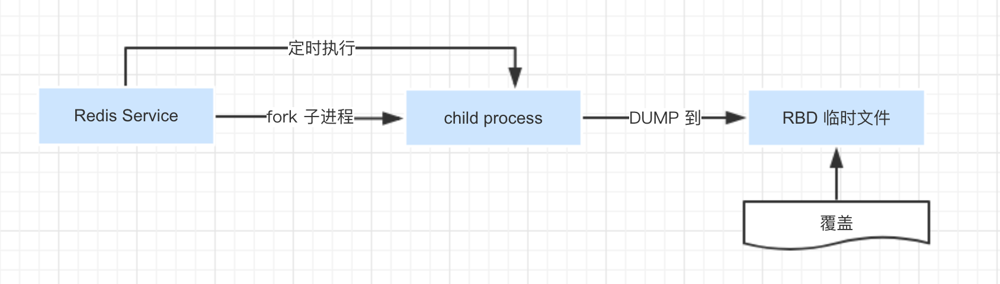
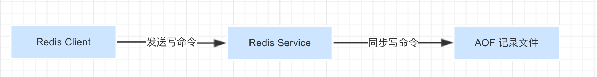

## 持久化方式

:::tip RDB - Redis DataBase
RDB持久化方式能够在指定的时间间隔能对你的数据进行快照存储。
:::

:::tip AOF - Append Only File
AOF持久化方式记录每次对服务器写的操作,当服务器重启的时候会重新执行这些命令来恢复原始的数据,AOF命令以redis协议追加保存每次写的操作到文件末尾
:::

## RDB

::: tip 运行方式
RDB记录的是某一刻的数据集，快照存储
:::

### 优点

* RDB在保存RDB文件时`父进程`唯一需要做的就是`fork出一个子进程`,接下来的工作全部由子进程来做，`父进程不需要再做其他IO操作`，所以RDB持久化方式可以最大化redis的性能.

* 与AOF相比,在恢复大的数据集的时候，RDB方式会更快一些.

### 缺点

* 如果你希望在redis意外停止工作（例如电源中断）的情况下丢失的数据最少的话，那么RDB不适合你.

* 虽然你可以配置不同的save时间点(例如每隔5分钟并且对数据集有100个写的操作),是Redis要完整的保存整个数据集是一个比较繁重的工作,你通常会每隔5分钟或者更久做一次完整的保存,万一在Redis意外宕机,你可能会丢失几分钟的数据。

## AOF

::: tip 运行方式
AOF保存的是redis命令，不断地将命令追加到文件的末尾。
:::

### 优点

* 使用AOF 会让你的Redis更加耐久: 你可以使用不同的fsync策略：无fsync,每秒fsync,每次写的时候fsync.使用默认的每秒fsync策略,Redis的性能依然很好(fsync是由后台线程进行处理的,主线程会尽力处理客户端请求),一旦出现故障，你最多丢失1秒的数据.

* AOF文件是一个只进行追加的日志文件,所以不需要写入seek,即使由于某些原因(磁盘空间已满，写的过程中宕机等等)未执行完整的写入命令,你也也可使用`redis-check-aof`工具修复这些问题.

* Redis 可以在 AOF 文件体积变得过大时，自动地在后台对 AOF 进行重写： 重写后的新 AOF 文件包含了恢复当前数据集所需的最小命令集合。 整个重写操作是绝对安全的，因为 Redis 在创建新 AOF 文件的过程中，会继续将命令追加到现有的 AOF 文件里面，即使重写过程中发生停机，现有的 AOF 文件也不会丢失。 而一旦新 AOF 文件创建完毕，Redis 就会从旧 AOF 文件切换到新 AOF 文件，并开始对新 AOF 文件进行追加操作。

* AOF 文件有序地保存了对数据库执行的所有写入操作， 这些写入操作以 Redis 协议的格式保存， 因此 AOF 文件的内容非常容易被人读懂， 对文件进行分析（parse）也很轻松。 导出（export） AOF 文件也非常简单： 举个例子， 如果你不小心执行了 FLUSHALL 命令， 但只要 AOF 文件未被重写， 那么只要停止服务器， 移除 AOF 文件末尾的 FLUSHALL 命令， 并重启 Redis ， 就可以将数据集恢复到 FLUSHALL 执行之前的状态。

### 缺点

* 对于相同的数据集来说，AOF 文件的体积通常要大于 RDB 文件的体积。

* 根据所使用的 fsync 策略，AOF 的速度可能会慢于 RDB 。 在一般情况下， 每秒 fsync 的性能依然非常高， 而关闭 fsync 可以让 AOF 的速度和 RDB 一样快， 即使在高负荷之下也是如此。 不过在处理巨大的写入载入时，RDB 可以提供更有保证的最大延迟时间（latency）。

## RDB + AOF

::: tip 
* 你也可以同时开启两种持久化方式, 在这种情况下, 当redis重启的时候会优先载入AOF文件来恢复原始的数据,因为在通常情况下AOF文件保存的数据集要比RDB文件保存的数据集要完整.
:::

## 如何选择持久化方式？

* 一般来说， 如果想达到足以媲美 PostgreSQL 的数据安全性， 你应该同时使用两种持久化功能。

* 如果你非常关心你的数据， 但仍然可以承受数分钟以内的数据丢失， 那么你可以只使用 RDB 持久化。

* 有很多用户都只使用 AOF 持久化， 但我们并不推荐这种方式： 因为定时生成 RDB 快照（snapshot）非常便于进行数据库备份， 并且 RDB 恢复数据集的速度也要比 AOF 恢复的速度要快， 除此之外， 使用 RDB 还可以避免之前提到的 AOF 程序的 bug 。
